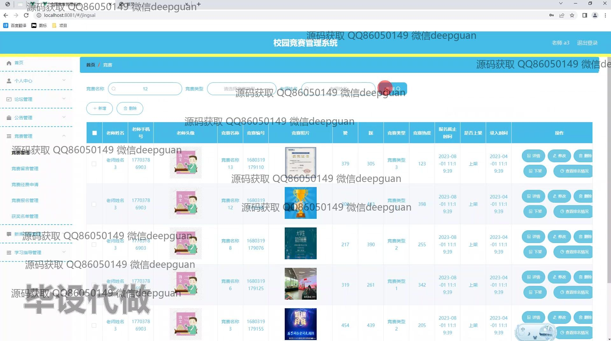
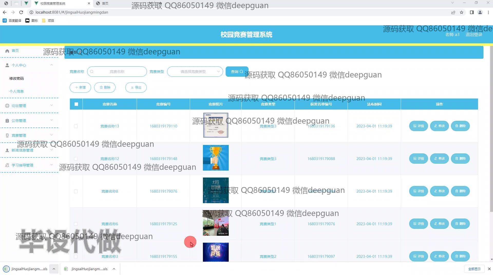

<h1 align="center">校园竞赛管理系统</h1>

## 简介
校园竞赛管理系统：角色分为管理员、用户；功能包括竞赛报名管理、论坛交流、公告发布、学习指导、获奖查询、用户注册等，旨在提高竞赛组织效率和参与度，提供便捷的在线管理平台。    --计算机毕业设计源码；毕设源码；java毕业设计源码

## 联系方式

<h3 align="center">获取完整代码与数据库文件 + 微信：deepguan QQ: 86050149 QQ群: 783742310</h3>

<h3 align="center">可帮忙远程部署 包运行成功！提供远程部署、修改代码、设计文档指导、代码讲解等服务！</h3>

## 功能介绍（完整见运行截图）
管理员：登录、注册、管理用户账户及权限，管理系统公告与通知，创建和编辑竞赛信息，审核和管理报名信息与竞赛结果，管理论坛和进行内容审核，统计与分析竞赛数据并生成报表，管理学习指导材料和类型，维护系统基础数据与模块设置。 用户：注册与登录系统，浏览与报名校园竞赛，查看竞赛详情与公告，参与论坛讨论与评论互动，查阅学习指导和竞赛新闻，查看获奖名单并下载相关材料，管理个人信息及账户设置，提供意见反馈与竞赛作品上传。

## 运行截图

本代码来源于网络,仅供学习参考使用!

